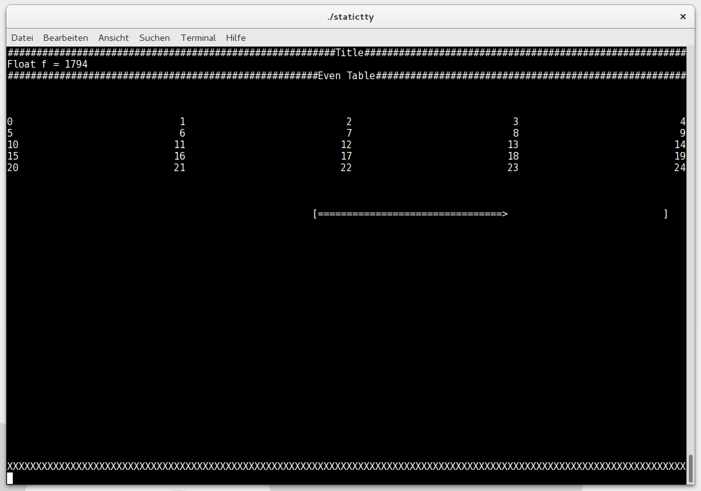

# staticTTY
Header only library, to provide a static (non scrolling) tty interface with fancy progress bars and relative positioning of elements.

# Usage

- Include the StaticTTY.hpp header to use the library
- TTY class can be used like std::cout to print text, but the screen will stay static and all non const references get refreshed in realtime
- linebreak can be achieved by using '\n' character
- example can be found in main.cpp

# Primitives

```cpp
StaticTTY tty;
float value;
tty << value << "\n"; //value will be updated onscreen
const float const_value;
tty << const_value << "\n"; //const values are not updated

tty << "Some text" << "\n"; //Input of basic text

tty.finish(); //Close update thread and clean up before exiting

tty << HSpace('#') << "\n"; //Fill an entire line with a char
tty << HSpace(' ') << "text" << HSpace(' ') << "\n"; //Align text in the middle

tty << VSpace(); //Fill vertical space

float percent;
//Show prograssbar on the right side of the screen, which represents the value of percent
tty << HSpace(' ') << Progressbar<float>(50, 0, 100, percent);

```

# Example screen

